# Position Measurement and References

| **Requested by:** | **AURA** |
|-------------------|----------|
| **Doc. Code**     | #{documentCode}       |
| **Editor:**       | Alberto Izpizua         |
| **Approved by:**  | Julen García         |

## Index

- [Position Measurement and References](#position-measurement-and-references)
  - [Index](#index)
  - [Introduction](#introduction)
  - [Encoder Head data](#encoder-head-data)
  - [Head reference offset calculation](#head-reference-offset-calculation)
    - [Azimuth heads offsets](#azimuth-heads-offsets)
    - [Elevation heads offsets](#elevation-heads-offsets)
  - [Telescope offset](#telescope-offset)
    - [Azimuth Cable Wrap](#azimuth-cable-wrap)

## Introduction

This document will show how to manage the references in the encoder (EIB) to set the absolute position for each head and for the telescope.

First a brief introduction to head data is shown, and how the EIB calculates the references to get the absolute position.
Then the calculation of the head references offset is shown. This procedure will make that all heads read the same value as an absolute value.
Lastly, the procedure to convert this value to Telescope absolute value is used.

## Encoder Head data

As shown in the [EIB documentation](https://gitlab.tekniker.es/publico/3151-lsst/documentation/pxicontroller_documentation/-/tree/master/06%20Subsystem%20EIB), the encoder is absolute after performing a reference procedure.

At the referenced document is shown that each encoder head sends its relative position and when performing the reference procedure a reference value is sent. This value is subtracted to the relative position to get the absolute position of the head in the encoder tape. In this sense, each head sends the head relative position and the reference data to convert this position to the absolute position of the head in the tape the head is reading to.  So that, this absolute position is the absolute position of each head and each head has its own absolute position, since they are located in different positions along the tape.

The axis need to have the same position value in all the heads (or at least with a small difference between heads), to solve this issue, there is an offset. This offset must be calculated with a procedure for each axis. **The adjustment procedure must be applied if one head is adjusted in position or one is replaced.**

## Head reference offset calculation

The head reference offset calculation depends on the axis. For azimuth axis, the four heads reads in the same tape, but in elevation axis there are two heads in the X+ cradle and two heads in the X- cradle. This make that the procedure is different for both axis. In next sections the procedure for each axis is explained.

Tekniker developed a tool to calculate the offset. The Tool is named Head Reference Offset Calculation Tool and is located at /usr/local/TMA_HeadReferenceOffsetCalculationTool.

Running the application the window shown in next figure appears. This windows allow to select the axis to work with or exit the application.

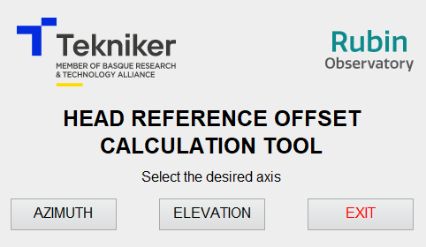

In this document only the use of this document with the EUI is explained, and so that some elements of the tool windows are not mentioned.

> **IMPORTANT**
> The procedures in this document are only valid for change/modify one or two heads per axis
>
> If more heads must be changed/modified use this procedure several times or contact to Tekniker

### Azimuth heads offsets

> **WARNING**
> THIS PROCEDURE IS VALID IF THE HEAD POSITION CHANGE IS SMALLER THAN 0.5 DEG. THIS IS, THE HEAD SUPPORT IS NOT MODIFIED OR ITS POSITION IS NOT MODIFIED.
>

When a head from azimuth axis is changed or relocated this procedure should be fulfilled. This procedure starts after the head is validated in the azimuth full range.

1. Power on the azimuth axis.
2. Home azimuth axis
3. open the ENCODER SYSTEM window in the EUI
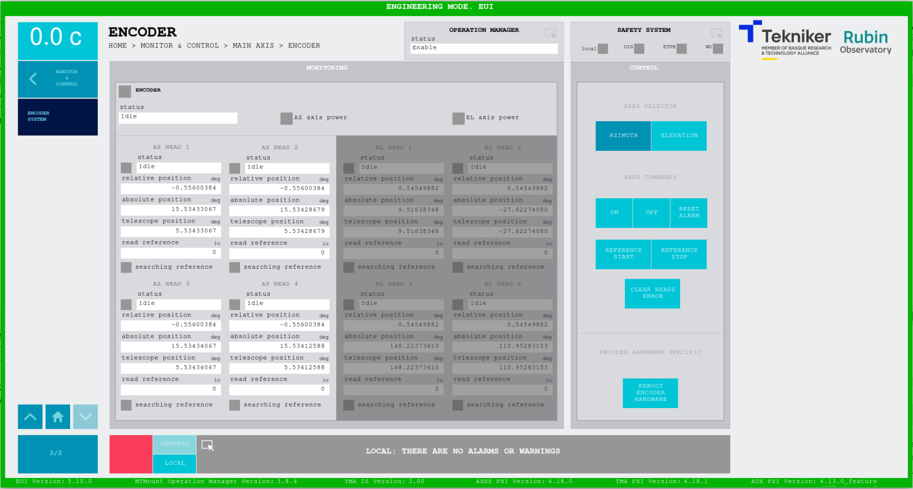
4. Take the absolute position of the heads that were **not modified** and calculate the mean value. Note down this value since this will be the absolute value we want to set.
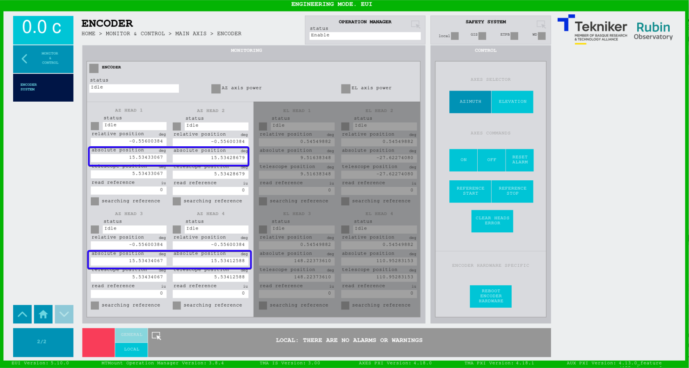
5. Open the Head Reference Calculation Tool for the Azimuth axis
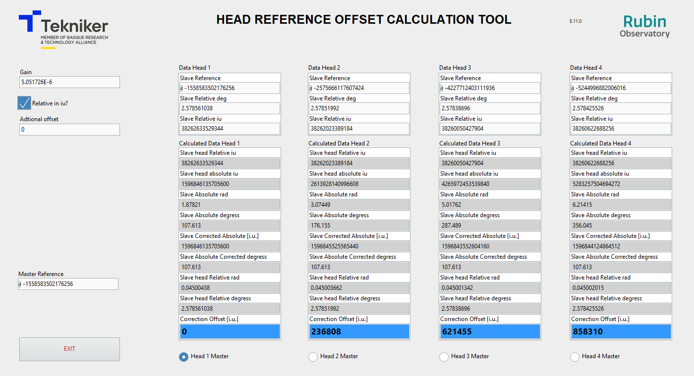
6. Ensure that the "Relative in iu?" checkbox is unchecked.

7. Copy the "relative position" from the ENCODER SYSTEM window to the  "Slave relative deg" in the tool for each head
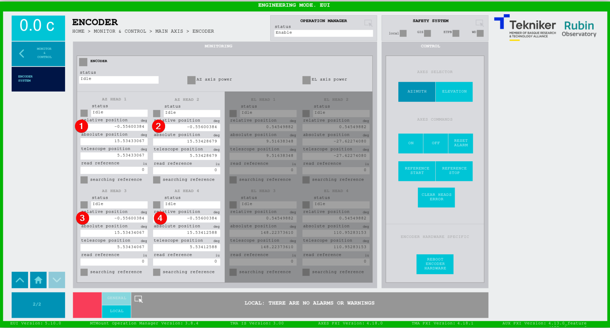
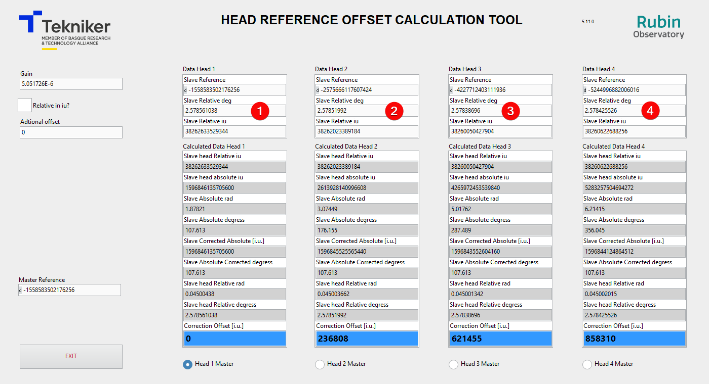
8. Copy the "read reference data" form the ENCODER SYSTEM window to the "Slave Reference"  in the tool for each head
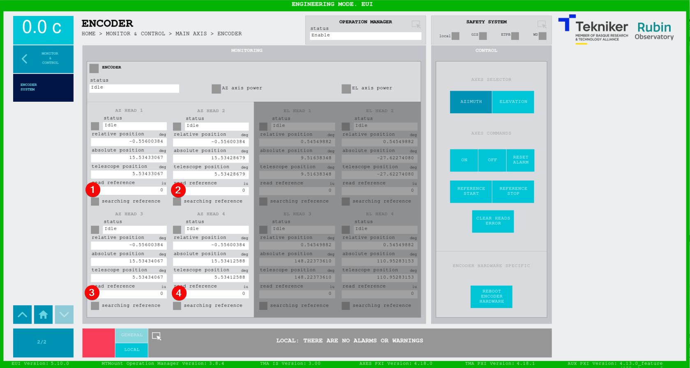
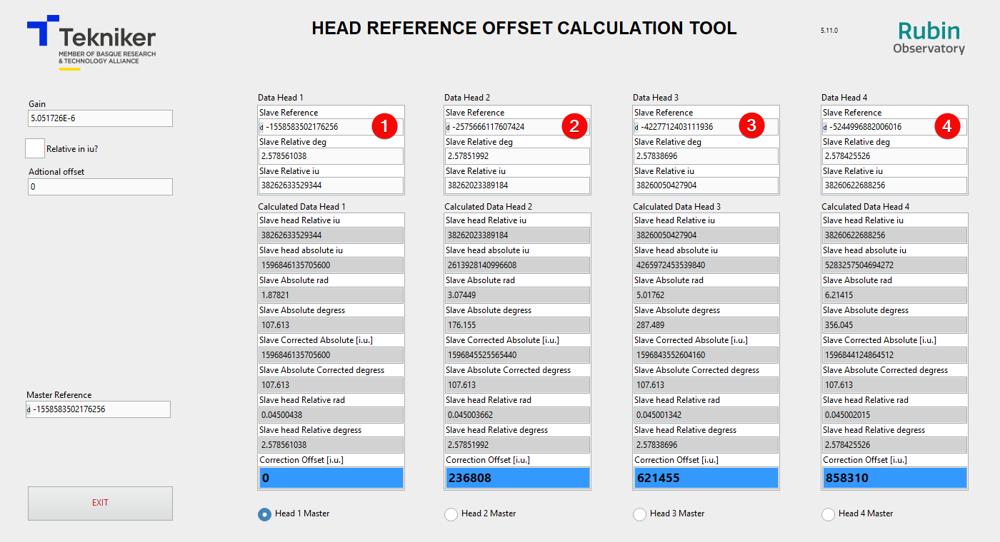
9. Power off the azimuth axis
10. Select the Head 1 as master head. This makes that all heads give an absolute position of 0 deg when the head 1 is located in the azimuth tape junction. In this situation the value of the "Correction Offset [i.u.]" is 0 for the Head 1 while it have a different value the other 3 heads.
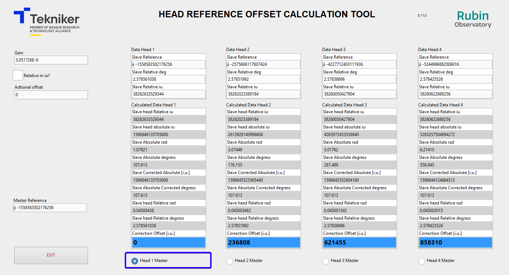
11. The desired absolute position is the one calculated in step 4. So insert the "Slave Absolute Corrected degrees" - step 4 calculated value in the "Additional offset"
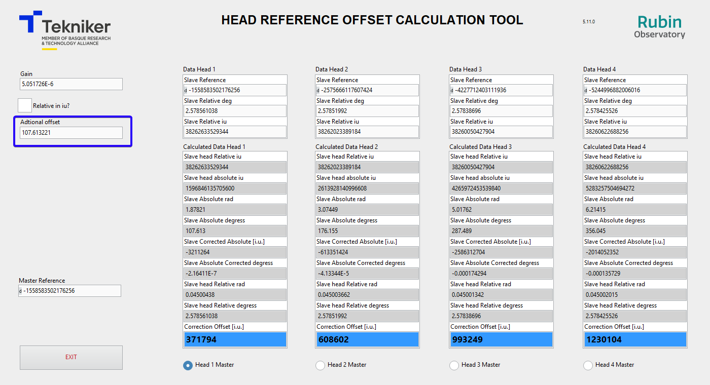
1.  The "Correction offset [i.u.]" are the values that must be updated in the ENCODER SETTINGS window in the "Position Offset" setting. The matching between head and head instance in the ENCODER SETTINGS is shown in next list. 
    1.  Head 1 --> Instance Head1
    2.  Head 2 --> Instance Head3
    3.  Head 3 --> Instance Head5
    4.  Head 4 --> Instance Head7
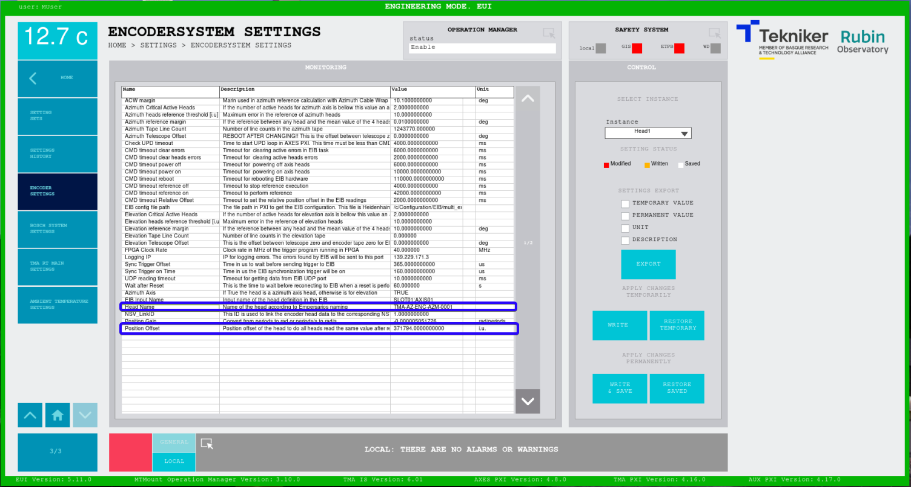
1. Power on azimuth axis and home axis. Check that the changes take effect and the system works properly. All the heads should read a similar absolute position (In previous test a difference bellow XXX in all range is recorded). The differences in the absolute position of each head varies along the telescope range, so the only position where the absolute position should be equal (the difference will be bellow 0.0003 deg) for all heads is in the position where the correction was applied.
2. A star calibration is recommended to correct the Telescope offset

### Elevation heads offsets

> **WARNING**
> IF THE HEAD POSITION IS CHANGED MORE THAN 10 DEG SOME ADDITIONAL STEPS MAY BE PERFORMED.
>
> The software limits should be disabled if the change is big, because the absolute position calculated without when doing the home could be outside the allowed

1. Power on the elevation axis.
2. It is recommended to move the elevation axis to 45 degrees. This allow to have more "distance" to software limits.
3. Home elevation axis
4. open the ENCODER SYSTEM window in the EUI

1. Take the absolute position of the heads that were **not modified** and calculate the mean value. Note down this value since this will be the absolute value we want to set.
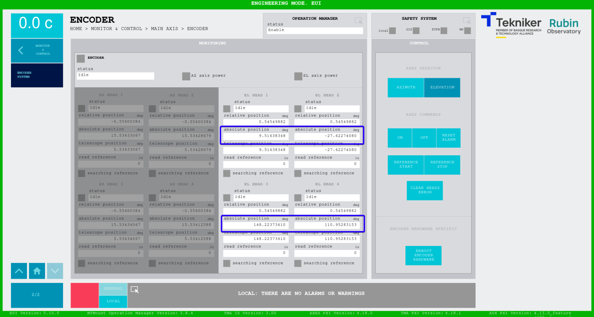
1. Open the Head Reference Calculation Tool for the Elevation axis
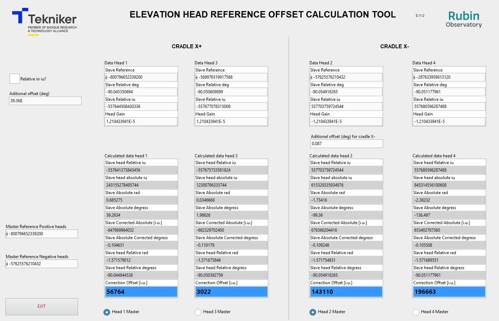
1. Ensure that the "Relative in iu?" checkbox is unchecked.

1. Copy the "relative position" from the ENCODER SYSTEM window to the  "Slave relative deg" in the tool for each head
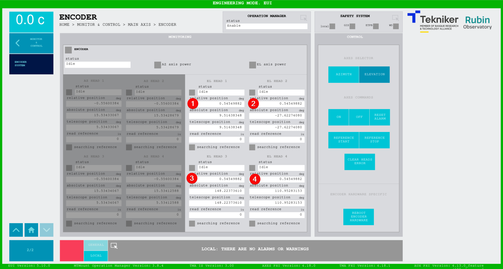
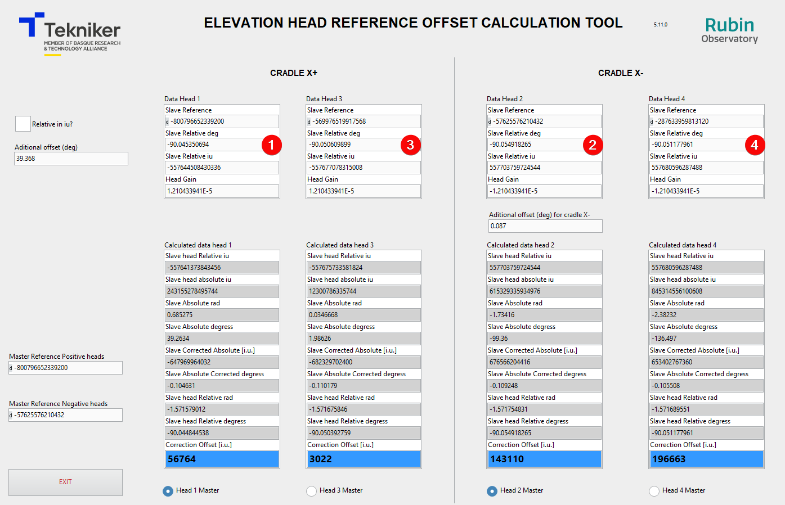
1. Copy the "read reference data" form the ENCODER SYSTEM window to the "Slave Reference"  in the tool for each head
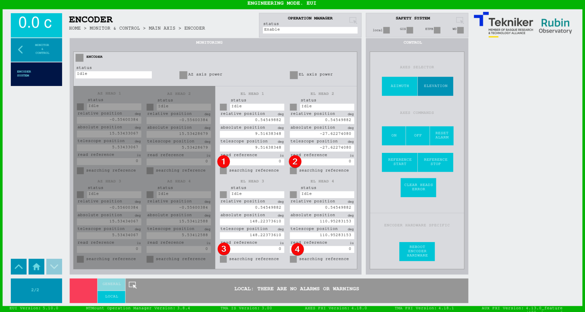
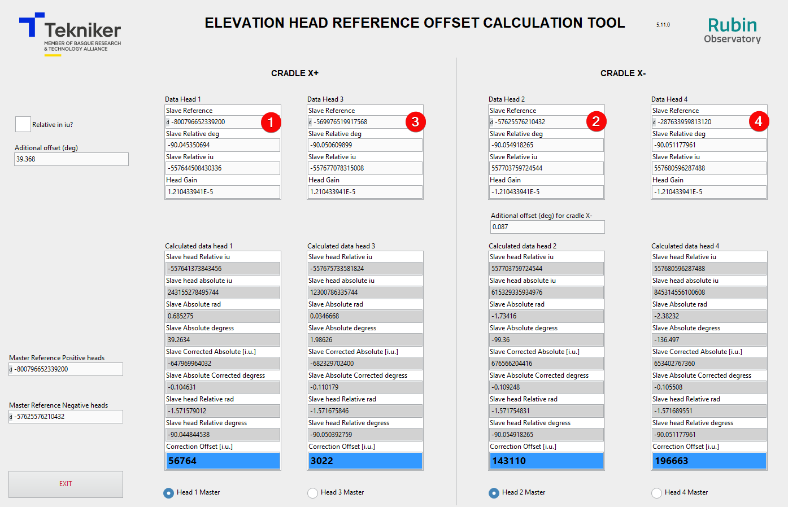
1. Power off the elevation axis
2. Select the Head 1 as master head for cradle X+. This makes that Head 1 and Head 3 read and absolute position of 0 deg when the head 1 is located in the beginning of the the tape of cradle X+. Then select Head 2 as master head for cradle X-. This makes that head 2 and Head 4 read and absolute position of 0 at the end of the tape of cradle X-. Cradle X- tape makes to read in opposite sense of cradle X+ tape, so the end of the tape in cradle X- is in the same position as cradle X+ tape beginning position. In this situation the value of the "Correction Offset [i.u.]" is 0 for the Head 1, 200000 for Head 2 and different value for Head 3 and 4. The "Slave Absolute Corrected degrees" for all the head should be very similar. In the Tekniker adjustment it was bellow 0.1 deg and the main difference was between heads of each cradle.

1. To reduce the difference between reading values of heads of different cradles the "Additional Offset (deg)for cradle X-" can be adjusted. This adjustment was skipped in Tekniker's first adjustment.
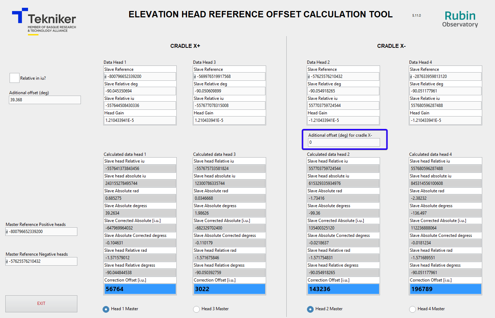
2. The desired absolute position is the one calculated in step 4. So insert the "Slave Absolute Corrected degrees" - step 4 calculated value in the "Additional offset"
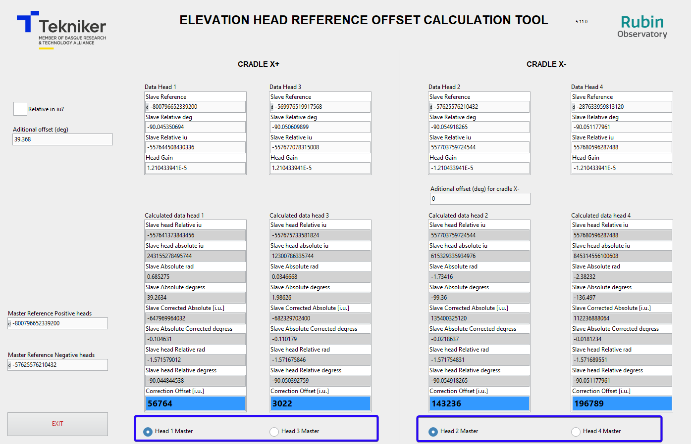
1. The "Correction offset [i.u.]" are the values that must be updated in the ENCODER SETTINGS window in the "Position Offset" setting. The matching between head and head instance in the ENCODER SETTINGS is shown in next list.
    1. Head 1 --> Instance Head2
    2. Head 2 --> Instance Head4
    3. Head 3 --> Instance Head6
    4. Head 4 --> Instance Head8

1. Power on elevation axis and home axis. Check that the changes take effect and the system works properly. All the heads should read a similar absolute position (In previous test a difference bellow XXX in all range is recorded). The differences in the absolute position of each head varies along the telescope range, so the only position where the absolute position should be equal (the difference will be bellow the one left in step 12) for all heads is in the position where the correction was applied.
2. A star calibration is recommended to correct the Telescope offset

## Telescope offset

For each axis there is a setting that allow to correct the absolute position of the telescope. This setting are shown in any instance of ENCODER SETTINGS, but there is only one setting for all heads. So, changing the value in one of the instances will change for all "instances" (this setting belongs to subsystem itself, so to all instances, due to this particularity the settings that belongs to the subsystem are shown in all instances in HMI)

For azimuth axis, the setting is called "Azimuth Telescope Offset".

> **DANGER**
>
> **REBOOT THE TMA PXI AFTER CHANGING THE "AZIMUTH TELESCOPE OFFSET" AND BEFORE SWITCHING ON THE AZIMUTH AXIS AGAIN**
>
> This applies to azimuth axis and to azimuth cable wrap. If the TMA-PXI is not rebooted damages in the Azimuth cable wrap could happen.
>

For elevation axis, the setting si called "Elevation Telescope Offset".

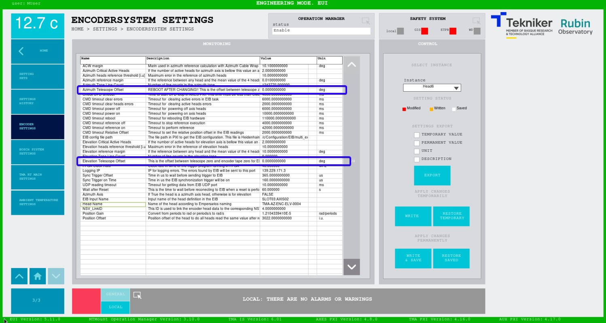

### Azimuth Cable Wrap

The azimuth cable wrap follows the azimuth position, so the change of the azimuth absolute position with the "Azimuth Telescope Offset" affects to the gap between azimuth and azimuth cable wrap. This is issue is managed by the azimuth cable wrap software and the azimuth cable wrap command position will be adapted to the "Azimuth Telescope Offset" setting, but it needs a **reboot of the TMA PXI**.
