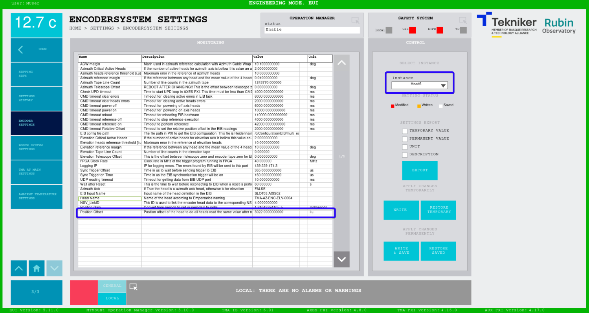

# Position Measurement and References

| **Requested by:** | **AURA** |
|-------------------|----------|
| **Doc. Code**     | #{documentCode}       |
| **Editor:**       | Alberto Izpizua         |
| **Approved by:**  | Julen García         |

## Index

- [Position Measurement and References](#position-measurement-and-references)
  - [Index](#index)
  - [Introduction](#introduction)
  - [Encoder Head data](#encoder-head-data)
  - [Head reference offset calculation](#head-reference-offset-calculation)
    - [Azimuth heads offsets](#azimuth-heads-offsets)
    - [Elevation heads offsets](#elevation-heads-offsets)
  - [Telescope offset](#telescope-offset)
    - [Azimuth Cable Wrap](#azimuth-cable-wrap)

## Introduction

This document will show how to manage the references in the encoder (EIB) to set the absolute position for each head and for the telescope.

First a brief introduction to head data is shown, and how the EIB calculates the references to get the absolute position.
Then the calculation of the head references offset is shown. This procedure will make that all heads read the same value as an absolute value.
Lastly, the procedure to convert this value to Telescope absolute value is used.

## Encoder Head data

As shown in the [EIB documentation](https://gitlab.tekniker.es/publico/3151-lsst/documentation/pxicontroller_documentation/-/tree/master/06%20Subsystem%20EIB), the encoder is absolute after performing a reference procedure.

At the referenced document is shown that each encoder head sends its relative position and when performing the reference procedure a reference value is sent. This value is subtracted to the relative position to get the absolute position of the head in the encoder tape. In this sense, each head sends the head relative position and the reference data to convert this position to the absolute position of the head in the tape the head is reading to.  So that, this absolute position is the absolute position of each head and each head has its own absolute position, since they are located in different positions along the tape.

The axis need to have the same position value in all the heads (or at least with a small difference between heads), to solve this issue, there is an offset. This offset must be calculated with a procedure for each axis. **The adjustment procedure must be applied if one head is adjusted in position or one is replaced.**

## Head reference offset calculation

The head reference offset calculation depends on the axis. For azimuth axis, the four heads reads in the same tape, but in elevation axis there are two heads in the X+ cradle and two heads in the X- cradle. This make that the procedure is different for both axis. In next sections the procedure for each axis is explained.

Tekniker developed a tool to calculate the offset. The Tool is named Head Reference Offset Calculation Tool and is located TODO:Location.

Running the application the window shown in next figure appears. This windows allow to select the axis to work with or exit the application.

### Azimuth heads offsets

> **NOTE**
> THIS PROCEDURE IS VALID IF THE CHANGE HEAD POSITION IS SMALL. THIS IS, THE HEAD SUPPORT IS NOT MODIFIED OR ITS POSITION IS NOT MODIFIED.
>

When a head from azimuth axis is changed or relocated this procedure should be fulfilled. This procedure starts after the head is validated in the azimuth full range.

1. Power on the azimuth axis.
2. Home azimuth axis
3. open the ENCODER SYSTEM window in the EUI

4. Take the absolute position of the heads that were **not modified** and calculate the mean value. Note down this value since this will be the absolute value we want to set.

5. Open the Head Reference Calculation Tool for the Azimuth axis

6. Ensure that the "Relative in iu?" checkbox is unchecked.

7. Copy the "relative position" from the ENCODER SYSTEM window to the  "Slave relative deg" in the tool for each head

8. Copy the "read reference data" form the ENCODER SYSTEM window to the "Slave Reference"  in the tool for each head

9. Select the Head 1 as master head. This makes that all the heads give an absolute position of 0 deg when the head 1 is located in the azimuth tape junction. In this situation the value of the "Correction Offset [i.u.]" is 0 for the Head 1 while it have a different value the other 3 heads.

10. The desired absolute position is the one calculated in step 4. So insert the "Slave Absolute Corrected degrees" - step 4 calculated value in the "Additional offset"

11. The "Correction offset [i.u.]" are the values that must be updated in the ENCODER SETTINGS window in the "Position Offset" setting. The name of the encoder head is located in the setting "Head Name". The azimuth encoders are named aas TAM-AZ-ENC-AZM and then the head number. So the Head 1 is the TMA-AZ-ENC-AZM-0001, the head 2 is the TMA-AZ-ENC-AZM-0002 and so on.

### Elevation heads offsets

## Telescope offset

### Azimuth Cable Wrap

